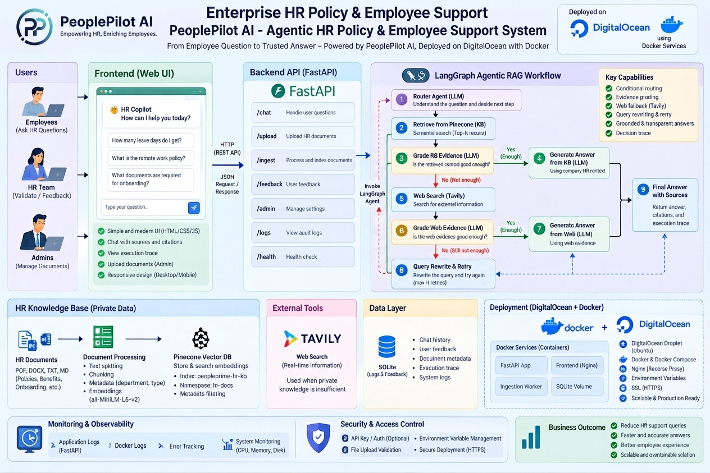

# Enterprise HR Policy & Employee Support System

An enterprise-ready, agentic RAG copilot that helps employees find reliable HR-policy information while giving HR teams a controlled way to grow the organisation's knowledge base.

Built with FastAPI, LangGraph, Groq, Pinecone, Tavily, and a lightweight HTML/CSS/JavaScript interface, the system searches approved internal policy documents first and uses public web search only when internal evidence is insufficient.



## Why it exists

HR teams often manage policies across handbooks, onboarding materials, leave guidance, benefits documents, and operational runbooks. Employees need answers quickly, but traditional search can be hard to use and a generic chatbot can invent policy details.

This project provides a policy-aware assistant designed to:

- Prioritise the private HR knowledge base for company-policy questions.
- Assess whether retrieved evidence is sufficient before answering.
- Use current public web information as a clearly labelled fallback.
- Rewrite ambiguous queries and retry retrieval when evidence is weak.
- Return source information and a visible agent decision trace.
- Restrict document ingestion to authorised HR administrators.
- Record query decision paths in SQLite for auditing and improvement.

> **Important:** This tool supports HR operations; it is not a replacement for HR, legal, payroll, or benefits advice. Public-web answers must be validated by HR before they are treated as company policy.

## How it works

```text
                        Employee question
                              |
                              v
  Route the request ── casual greeting ──> Direct response
                              |
                              v
         Search private HR knowledge base (Pinecone)
                              |
                              v
                      Grade internal evidence
                             |
        +--------------------+-----------------+
        | sufficient                           | insufficient
        v                                      v
Answer from private KB              Search public web (Tavily)
                                               |
                                               v
                                         Grade web evidence
                                               |
                    +--------------------------+--------------------+
                    |                                               |
                    v                                               v
                  good                                            weak
                    |                                               |
                    v                                               v
               Labelled web                             Rewrite query, retry,
                answer                           or return insufficient evidence
```

## Features

| Capability | Description |
| --- | --- |
| Private-first RAG | Retrieves from the organisation's indexed HR documents before considering external sources. |
| Agentic orchestration | LangGraph routes, grades, retries, and generates grounded responses. |
| Evidence-aware answers | Stops and asks the employee to contact HR when reliable evidence is unavailable. |
| Web fallback | Uses Tavily only after the private KB is judged insufficient; web answers are explicitly marked as external information. |
| Source transparency | Returns citations, the source type, and an execution trace for each chat response. |
| HR document ingestion | Authenticated API endpoint for indexing `.pdf`, `.docx`, `.md`, and `.txt` files. |
| Audit trail | Stores questions, answer source, and workflow trace in SQLite. |
| Container support | Includes a Dockerfile for consistent deployment. |

## Architecture

```text
            Employee or HR administrator
                         |
                         v
         Web interface / REST API (FastAPI)
                         |
                         v
          LangGraph HR support workflow
      +------------------+--------------------+
      |                  |                   |
      v                  v                   v
   Groq LLM       Pinecone private KB    Tavily web search
      |                  |                   |
      +------------------+-------------------+
                         |
                         v
    Grounded response, citations, trace, audit record
```

## Technology stack

| Layer | Technology |
| --- | --- |
| API and UI delivery | FastAPI, Jinja2, HTML, CSS, JavaScript |
| Agent workflow | LangGraph |
| LLM | Groq |
| Embeddings | Sentence Transformers|
| Vector database | Pinecone |
| External search fallback | Tavily |
| Document processing | LangChain loaders, PyPDF, python-docx |
| Audit storage | SQLite |
| Deployment | Docker |

## Project structure

```text
PeoplePilot-AI/
├── app/
│   ├── api/routes.py              # Health, chat, and protected ingestion endpoints
│   ├── core/config.py             # Environment-based application settings
│   ├── rag/workflow.py            # LangGraph agent workflow
│   ├── rag/vectorstore.py         # Pinecone retrieval and indexing
│   └── services/                  # Audit logging and document ingestion
├── data/sample_kb/                # Example HR policy content
├── docs/architecture.png          # Solution diagram
├── static/                        # Frontend CSS and JavaScript
├── templates/index.html           # Web interface
├── uploads/                       # Uploaded HR documents (runtime)
├── ingest_sample_kb.py            # Index sample policy documents
├── run.py                         # Local development entry point
├── requirements.txt
└── Dockerfile
```

## Prerequisites

- Python 3.12 or later
- A [Groq API key](https://console.groq.com/)
- A [Pinecone API key](https://www.pinecone.io/)
- A Pinecone index compatible with the configured embedding model
- A [Tavily API key](https://tavily.com/) for external-search fallback

## Quick start

### 1. Clone and create a virtual environment

```bash
git clone <your-repository-url>
cd PeoplePilot-AI
python -m venv .venv
```

Activate it:

```powershell
# Windows PowerShell
.\.venv\Scripts\Activate.ps1
```

```bash
# macOS / Linux
source .venv/bin/activate
```

### 2. Install dependencies

```bash
pip install -r requirements.txt
```

### 3. Configure environment variables

Create a `.env` file in the repository root. Never commit this file.

```env
GROQ_API_KEY=your_groq_api_key
GROQ_MODEL=openai/gpt-oss-20b

TAVILY_API_KEY=your_tavily_api_key

PINECONE_API_KEY=your_pinecone_api_key
PINECONE_INDEX_NAME=fde-hr-policy-rag
PINECONE_NAMESPACE=company-hr-kb

EMBEDDING_MODEL=sentence-transformers/all-MiniLM-L6-v2
TOP_K=4
MAX_RETRIES=1

# Use a strong secret outside local development.
ADMIN_API_KEY=change-me-in-production
APP_ENV=development
```

### 4. Index the sample knowledge base

```bash
python ingest_sample_kb.py
```

### 5. Run locally

```bash
python run.py
```

Open the app at [http://127.0.0.1:8080](http://127.0.0.1:8080). Interactive API documentation is available at [http://127.0.0.1:8080/docs](http://127.0.0.1:8080/docs).

## API reference

| Method | Endpoint | Purpose |
| --- | --- | --- |
| `GET` | `/api/health` | Returns service health and application name. |
| `POST` | `/api/chat` | Sends an employee question through the HR support workflow. |
| `POST` | `/api/ingest` | Uploads and indexes an HR document; requires the `X-Admin-Key` header. |

### Ask a question

```bash
curl -X POST http://127.0.0.1:8080/api/chat \
  -H "Content-Type: application/json" \
  -d '{"question":"How many annual leave days do employees receive?"}'
```

The response contains an `answer`, `source_used`, `citations`, `trace`, and the `rewritten_query` used by the workflow.

### Upload a policy document

Supported formats are PDF, DOCX, Markdown, and plain text.

```bash
curl -X POST http://127.0.0.1:8080/api/ingest \
  -H "X-Admin-Key: change-me-in-production" \
  -F "file=@path/to/hr-policy.pdf"
```

## Example scenarios

| Question | Expected behaviour |
| --- | --- |
| “How many annual leave days do employees receive?” | Answer from the private HR knowledge base when the handbook contains the policy. |
| “How many days a week can I work remotely?” | Retrieve and answer from the relevant company remote-work policy. |
| “What are the latest public holiday rules in Bangladesh?” | Use external search only if internal policy evidence is insufficient, and label the result for HR validation. |
| “What happens if mine is wrong?” | Rewrite the ambiguous query, retry retrieval, or avoid guessing when evidence remains weak. |

## Docker

Build and run the application with your environment variables supplied at runtime:

```bash
docker build -t enterprise-hr-support .
docker run --rm -p 8080:8080 --env-file .env enterprise-hr-support
```

## Security and operational notes

- Keep API keys and `ADMIN_API_KEY` in a secret manager in production.
- Change the default admin key before deployment and limit access to `/api/ingest`.
- Review and approve documents before indexing them; retrieved content directly affects answers.
- Treat external results as informational, not as authoritative company policy.
- The local audit database contains user questions and workflow metadata. Apply your organisation's retention, access-control, and privacy policies.
- Add authentication, role-based access control, encryption, monitoring, rate limiting, and production-grade audit controls before enterprise deployment.

## License

This project is distributed under the [Apache License 2.0](LICENSE).
